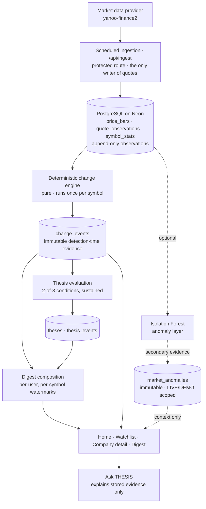

# THESIS

### A watchlist that remembers *why* you're watching.

Traditional watchlists tell you where a stock is now. THESIS remembers **why you were
watching it**, detects meaningful changes while you are away, preserves what happened
even when it reverses before you get back, and shows you the evidence — the actual
numbers recorded at the moment of detection — when you return.

**[Live demo](https://thesis-market-watchlist.vercel.app)** ·
**[Repository](https://github.com/tanisha-raha/thesis-market-watchlist)** ·
**[Engineering decisions](DECISIONS.md)**

Built for **Code, by Groww 2026** — theme: *Build a Smart Market Watchlist*.

---

## The product

### Home — your market brief

Two markets, each on its own clock: India and the US report their session state
separately, every index carries its own exchange-local timestamp, and a compact strip
bridges the market view to your own reasons for watching.


### Smart watchlist — what you follow, and why

One list can hold `INFY.NS` in ₹ on Mumbai time next to `AAPL` and `BLK` in $ on New
York time. Nothing is converted, nothing is aggregated across currencies, and every
row carries the condition you set and its current deterministic state.


### While you were away

The digest below is real: four events that **fired and reversed inside a single
trading session** while this account was away. Each one is proved invisible on daily
closes — *"Closed at ₹1,773.20, back below ₹1,778.12. On daily closes this would not
appear at all."* — which is the clearest demonstration of what THESIS is for.


### Company detail

| | |
|---|---|
|  |  |
| **Price history and your thesis.** Ranges are offered only where observations exist — 1D and 1W from the observed intraday path, 1M/3M/1Y from daily closes. | **Ask THESIS.** Answers from your stored evidence, and declines to recommend a trade. |
|  |  |
| **Recorded Evidence.** The figures captured when the event fired, never recomputed from the latest quote. | **Market Pattern.** The anomaly layer's one claim, kept separate from the evidence it saw. |
|  |  |
| **Thesis Replay.** How *your* condition behaved against observed history — occurrences, not returns. | **Light mode.** The same information hierarchy in every appearance — Light, Dark and Aurora. |

*Every screenshot is the running application against real stored market data, captured
from a production build by `npm run screenshots`. No mockups, no typed-in values.*

---

## The problem

A normal watchlist answers **"what is the price now?"**

THESIS answers **"what meaningfully changed since I last checked, and does it matter to
why I was watching?"**

That reframes "meaningful" into two dimensions that have to be handled separately:

| | |
|---|---|
| **Market significance** | Was this move unusual *for this security* — against its own volatility, its own volume, its own benchmark? |
| **Personal relevance** | Does it touch the reason *this user* is watching — the condition they wrote down? |

They are not the same thing, and the product refuses to pretend they are. A
statistically remarkable day on a stock you hold no view about may be worth nothing to
you. A quiet, unremarkable day that finally crosses the level you were waiting for is
the most important thing on your screen.

---

## How it works

**Define → Test → Monitor → Detect → Remember → Explain**

| Step | What happens |
|---|---|
| **Define** | You record *why* you're watching as a structured, machine-verifiable condition — not free text we interpret. |
| **Test** | Thesis Replay shows how that exact condition behaved against recently observed sessions, before you rely on it. |
| **Monitor** | Scheduled ingestion polls quotes and stores an append-only price path; page loads never fetch from the provider. |
| **Detect** | A deterministic engine scores every symbol once, records what changed, and resolves conditions that stop holding. |
| **Remember** | Events are immutable and keep `occurredAt` / `resolvedAt`, so something that fired and reversed while you were away still exists when you return. |
| **Explain** | The digest, the evidence panels and Ask THESIS render the numbers recorded at detection — never a recomputation. |

---

## Key features

### Smart watchlist
Search across NSE, BSE, NASDAQ and NYSE from one company index; add anything the
provider can quote. Every security carries its own exchange, native currency and
exchange timezone, taken from provider metadata rather than assumed.

### While you were away
A per-user digest since the last **fully committed** ingestion batch: triggered
conditions, contradicted theses, missed events, and what stayed unchanged. Watermarks
are per `(user, symbol)` and monotonic, so opening one company does not mark everything
else as seen.

### Structured thesis
`price_range`, `breakout`, `momentum_up`, `momentum_down`, `volatility_watch`,
`volume_expansion`, or plain watching. States are `WATCHING → TRIGGERED /
CONTRADICTED / STILL_VALID`, evaluated deterministically. Your free-text note is
displayed back exactly as written and never parsed.

### Missed events
The feature a current-state app cannot have: a condition that became true and stopped
being true entirely inside your away-window, with the daily bar for that session used
to *prove* it would have been invisible on closes.

### Thesis Replay
Runs your own condition against recently observed sessions — how often it occurred, how
often it resolved, the longest run. It is condition replay, deliberately **not**
strategy backtesting: no returns, no hypothetical P&L.

### Market Pattern — machine learning
An Isolation Forest, fitted per security on its own recent history, answering one
question the deterministic rules structurally cannot: *is this combination of signals
unusual for this company?* Secondary evidence, never authoritative.
[Details below.](#machine-learning-isolation-forest)

### Recorded Evidence
The quantitative evidence captured when an event fired — the move and its standardized
size, the volume ratio, the stock-specific residual — stored immutably and rendered
as-is.

### Ask THESIS
A finance assistant that also happens to hold your records. Ask it what a P/E
ratio is, why interest rates move share prices, or what to look at when comparing
two companies, and it answers as a finance assistant would. Ask it about *your*
watchlist and it answers from stored evidence instead — and says which is which.

Routing is decided by **ownership, not by company names**. "Tell me about
Reliance" is a finance question; "Explain my Reliance thesis" is a question about
a record. Four intents:

- **GENERAL** — markets, investing, accounting, economics, and companies discussed
  in general terms. The configured model is the primary path here. Where THESIS
  has recorded something about a company that came up, a clearly separated
  *"From your THESIS data"* block is appended — it enriches the answer, never
  replaces it.
- **GROUNDED_THESIS** — your watchlist, saved condition and note, deterministic
  verdict, detected events with detection-time evidence, the anomaly
  classification, the replay, and what the engine's contradiction rule requires
  before your condition would be called invalid. Composed on the server from
  committed rows, and never sent to any external service.
- **ADVISORY** — no buy, sell, hold, price target or forecast. The refusal is one
  sentence; the rest of the reply is the evaluation framework and any recorded
  evidence for the companies named.
- **FOLLOW_UP** — a message with no content of its own ("why does it matter?",
  "which one is more volatile?") resolves to whatever the conversation was doing,
  carrying its companies and concepts.

**The model is the general path; the 60-concept table is what answers without
one.** Set `OPENAI_API_KEY` for unrestricted general chat. Without it, concepts,
frameworks, company evidence, comparisons and every grounded answer still work,
and anything outside them says so plainly rather than guessing.

---

## What counts as "meaningful"?

THESIS deliberately does **not** define meaningful as *"the price moved more than X%"*.
A 4% move means nothing until you know how much this security usually moves, how much
of it was the market, and whether anyone was watching for it.

Deterministic evidence the engine records:

- **Volatility-standardized movement** — the move in units of the security's own
  20-day realized volatility, not in percent.
- **Relative volume** — the session's volume against its 20-day median.
- **Benchmark-relative residual** — what is left after the market's move is removed
  using the security's own 60-day beta. If the market moved and the stock followed,
  that is not news.
- **Reference levels** — 52-week and 20-day range crossings, and 20-day moving-average
  state, all with hysteresis so an oscillating price fires once.
- **Overnight gaps** — measured on the unadjusted series so dividend adjustment cannot
  manufacture one.
- **Your structured condition** — the only thing that turns a market fact into a
  personal one.

---

## System architecture

A single Next.js deployable, one Postgres database, one scheduled writer. No
microservices, no queues, no separate ML service — the architecture is deliberately
small, and the depth goes into the engines.



The dotted edges matter: **nothing downstream of the deterministic engine reads the
anomaly table**. Detection, thesis verdicts and the digest are computed without it.

---

## The deterministic engine

Detection runs **once per symbol**, not once per user — cost is O(unique symbols)
rather than O(users × symbols), and personalisation happens later by filtering shared
events against a user's watchlist and watermark.

**Standardized movement.** A move is expressed in the security's own daily volatility:

```
z   = r_t / σ₂₀              σ₂₀ = daily realized volatility over 20 traded sessions
z_k = R_k / (σ₂₀ · √k)       for a k-session move
```

Firing at `|z| ≥ 2.0` and clearing at `|z| < 1.5` — the gap is hysteresis, so a price
hovering at a threshold produces one event rather than a burst.

**Benchmark-relative residual.** `residual = r_stock − β₆₀ · r_index`, scored as
`residual / σ₂₀`. The benchmark is regional — `^NSEI` for Indian securities, `^GSPC`
for US ones — and when a market's index history is not stored, the signal is
**withheld** rather than computed against the wrong index.

**Relative volume.** `log(volume / median₂₀)`, firing at 2× and clearing at 1.2×,
guarded against the zero-volume bars the provider emits on holidays.

**Transience is the point.** `occurredAt` is when a condition became true;
`resolvedAt` is when it stopped. Resolution is evaluated against the **intraday**
series — on daily closes a move that reverses within the session leaves no trace, and
the missed-event feature would silently never fire.

**Contradiction requires 2 of 3 independent conditions**, each clearing a noise floor
expressed in the security's own volatility, sustained for 3 sessions. One noisy signal
never tells a user their reasoning failed.

---

## Machine learning: Isolation Forest

**Why a model at all.** Every deterministic signal above is univariate — a z-score, a
volume ratio, a level crossing. A day that is unremarkable in *each* dimension but
unusual as a whole passes every threshold individually and is never surfaced. That is
a real gap, and it is the only reason this layer exists.

| Layer | Question it answers |
|---|---|
| Deterministic engine | **What changed?** |
| Isolation Forest | **How unusual was the combined market state?** |
| Your thesis | **Does it matter to me?** |

**Why Isolation Forest.** It is unsupervised — there is no reliable ground truth for
whether a market observation "matters" to an investor, so there is nothing honest to
train a supervised classifier against. It is genuinely multivariate: it isolates points
that separate easily under random partitioning. It needs no feature scaling, because
splits are drawn between observed feature ranges. And it is compact enough to run
inside the existing deployable.

**Features** (all computed from data already stored):

| # | Feature | # | Feature |
|---|---|---|---|
| 1 | daily return | 5 | benchmark residual |
| 2 | standardized return | 6 | distance from MA20 |
| 3 | realized volatility | 7 | position in the 20-day range |
| 4 | log relative volume | 8 | gap return |

**Configuration:** 100 trees · 256-row subsample · seeded PRNG (identical inputs always
produce identical scores) · fitted on the security's own last 250 feature rows ·
minimum **60 usable training rows and 3 available features** · threshold is the **99th
percentile of that security's own training scores**, not a hardcoded constant.

**No future-data leakage, by construction.** Every rolling input for a session —
volatility, median volume, the moving average, the 20-day range, beta — is computed
from sessions *strictly before* it. The evaluated row is excluded from its own training
set, and `asOfDate` truncates the series, so evaluating an old session returns the same
answer today as it would have on the day. A test asserts identical output with and
without later bars present.

**Missing is missing.** A feature that cannot be computed is `null`, never `0` — zero
is a legitimate value for a return and for a distance from a moving average, so
imputing it would insert a fabricated flat day into training. A feature missing across
a security's history is dropped as a *column* for that security.

**Secondary, structurally.** It runs last in the ingestion pipeline, after every
deterministic write has committed. No deterministic module imports `lib/ml` — a test
asserts this by reading the sources. It cannot create a change event, cannot trigger or
contradict a thesis, and when it fails it records nothing.

**Output is categorical.** `UNUSUAL` / `NORMAL` / `INSUFFICIENT_HISTORY` /
`UNAVAILABLE`. The raw score is stored for reproducibility and never rendered: "0.68"
beside a company name reads as a rating no matter what the caption says. Isolation
Forest offers no per-feature attribution, so the UI makes one claim — this combination
was unusual — and separately shows the signals it saw, labelled as context rather than
causes.

**THESIS is not an AI stock predictor.** The model identifies unusual historical market
states. It does not forecast returns, rank securities, or express a view on price.

### Why TypeScript for the ML?

The application is already a single Next.js/TypeScript deployable, and Isolation Forest
is ~120 lines of a well-specified algorithm (Liu, Ting & Zhou, 2008). Implementing it
in-repo avoids a second deployment, a network boundary, and an operational failure mode
in a product whose central claim is that the core keeps working when optional things
fail. It also keeps the model seeded and deterministic, which is what lets stored
anomaly evidence be reproduced and end-to-end tested in the same suite as everything
else.

This is an intentional trade-off for this system's scale and shape — not a claim that
TypeScript beats Python for ML in general. A larger model, a heavier feature pipeline,
or anything needing established scientific libraries would justify the separate service
this one does not.

---

## Resilience and edge cases

| Problem | THESIS behaviour |
|---|---|
| A feed update fails | The last-known-good quote stays visible with its exchange timestamp and a degraded/stale label. Never blank, never a silently stale "live" price. |
| A batch partially fails | The batch is marked `FAILED`; the digest cutoff only ever uses the completion time of a **fully committed** batch, so a half-written poll can never define "since you last checked". |
| The provider silently drops a symbol | Batched quotes are reconciled against what was requested; a repeated miss escalates from *degraded* to *unresolved* rather than a row that quietly stops updating. |
| A condition fires and reverses while you are away | `occurredAt` and `resolvedAt` are preserved and it surfaces as a **missed event**, with the daily bar used to prove it was invisible on closes. |
| A price oscillates around a threshold | Hysteresis: a separate, stricter re-arm band means one event, not a burst. |
| The same move repeats within a day | A 24-hour cooldown requires a repeat to *escalate* by 1.5× to earn a new row. |
| The provider restates history (a split) | Uniformity, tolerance and plausibility guards validate the shift before anything user-level is touched. |
| Your thesis levels predate a split | Thesis parameters and the watermark price are adjusted by the same factor, the prior values are kept, and the UI shows the adjustment — never a silent rewrite. |
| A stale browser tab writes digest state | Watermarks are monotonic (`GREATEST`), so an older tab cannot resurface news you have already seen. |
| Ingestion runs twice | Every write is idempotent on a natural key; re-running detection over the same history cannot duplicate an event. |
| Holiday "phantom" bars (a real close with zero volume) | Excluded from every statistic and calendar — including them would deflate the volatility everything else is normalized by. |
| The ML layer has too little history | The Market Pattern section is omitted rather than showing a fabricated classification. |
| An ML feature is unavailable | The column is dropped for that security; missing market evidence is never zero-imputed. |
| The ML layer fails entirely | Detection, theses, digest, replay and the UI are unaffected — nothing downstream reads it. |
| A US security is watched with no US index history | Benchmark-relative evidence is withheld and beta stays null, rather than measuring AAPL against NIFTY 50. |

---

## Data and time semantics

- **Every instant is stored in UTC.** Exchange-local time exists only at the rendering
  edge — a NASDAQ quote is never stamped "15:30 IST", and a US security is not "stale"
  because the NSE is shut.
- **`trading_date` is a calendar fact**, stored as a `DATE` in the exchange's own zone.
  A session close becomes an instant through a zone-aware conversion that handles US
  daylight saving.
- **Prices stay in their native currency.** ₹ and $ appear side by side; nothing is
  converted or summed across currencies.
- **The latest quote and detection-time evidence are different things**, and the UI
  says so: "Captured at detection · values preserved from this event."
- **Provider history is not raw.** Yahoo's `close` is already split-adjusted and gets
  restated retroactively, so THESIS persists its own immutable as-observed bars at
  ingestion — the ratio between as-observed and current-provider values *is* the split
  factor.
- **LIVE and DEMO REPLAY never mix.** The deterministic replay provider drives
  reproducible demos and tests; anomaly evidence is stamped with its data mode, that
  mode is part of the row's identity, and reads filter on it.

---

## Data model

| Table | What it holds |
|---|---|
| `users`, `sessions` | Accounts with a stored display name; sessions store only a SHA-256 of the cookie token. |
| `symbols` | One row per security: name, exchange, currency, exchange timezone, feed-health counters. |
| `quotes` | Latest known quote per symbol, with the exchange's own `as_of` timestamp. |
| `watchlist_items` | Per-user membership, unique on `(user, symbol)` in the database. |
| `theses`, `thesis_events` | Structured conditions and their append-only verdicts with stored evidence. |
| `ingestion_batches` | One row per run; `completed_at` defines the digest cutoff. |
| `price_bars` | Daily bars holding both first-observed and current-provider values — corporate-action detection falls out of the storage design. |
| `quote_observations` | Append-only intraday price path; what makes a missed event visible. |
| `symbol_stats` | Recomputed statistics: realized volatility, median volume, MA20, beta, 52-week and 20-day levels. |
| `change_events` | Immutable detected events with `occurred_at` / `resolved_at` and detection-time `explain_json`. |
| `corporate_actions` | Inferred provider restatements with validation status and reason. |
| `user_symbol_read_state` | Per-(user, symbol) monotonic watermarks and split-adjusted baseline prices. |
| `market_anomalies` | Immutable anomaly evaluations: status, score, threshold, model version, data mode, feature snapshot, training window. |

Ten ordered migrations (`0000`–`0009`), every one additive.

---

## Tech stack

| Layer | Choice |
|---|---|
| Framework | Next.js 16 (App Router), React 19, TypeScript — one deployable, server components and server actions |
| Styling | Tailwind CSS v4 with a small design-token layer in `app/globals.css` |
| Database | PostgreSQL on Neon |
| Query layer | Drizzle ORM with drizzle-kit migrations |
| Market data | `yahoo-finance2`, behind a provider interface with a deterministic replay implementation |
| ML | Isolation Forest implemented in-repo (`lib/ml/`) — no ML dependency |
| Auth | Email + password, scrypt hashing, opaque session tokens stored hashed |
| Deployment | Vercel; daily stats via `vercel.json` cron, 10-minute polling via a GitHub Actions workflow hitting the protected route |
| Testing | Node-run integration/unit suite, a live-provider smoke test, and Playwright browser and visual matrices |

---

## Local setup

**Prerequisites:** Node 20+ and a PostgreSQL database (Neon's free tier works).

```bash
git clone https://github.com/tanisha-raha/thesis-market-watchlist.git
cd thesis-market-watchlist
npm install
cp .env.example .env.local
```

Set the variables in `.env.local`:

| Variable | Required | Purpose |
|---|---|---|
| `DATABASE_URL` | **yes** | Postgres connection string (Neon pooled URL, or any Postgres). |
| `CRON_SECRET` | for ingestion | Shared secret for `/api/ingest`. Without it the route refuses every request rather than failing open. |
| `OPENAI_API_KEY` | recommended | The primary path for Ask THESIS's **general** finance chat. Without it, general questions are answered from the built-in 60-concept table and anything outside it says so rather than guessing. Grounded answers never use it. |
| `OPENAI_MODEL` | optional | Defaults to `gpt-4.1-mini`. |
| `THESIS_DATA_MODE` | optional | Set to `demo` for the deterministic DEMO REPLAY path. |
| `SESSION_SECRET` | no | Legacy field kept in the template; current auth uses random opaque tokens and stores only their hashes. |

Then:

```bash
npm run db:migrate        # apply the ten migrations
npm run seed:load         # optional: 2y daily + 60d intraday history for the seeded universe
npm run dev               # http://localhost:3000
```

Create an account in the app and add a company — `Infosys`, `Apple` and `BlackRock` all
resolve. The app works against an empty database: without seeded history it shows quotes
and truthful "no stored history yet" states, and statistics, detection and replay appear
once history exists.

**Populating data yourself:** history is fetched locally and shipped as a committed seed
because the deployed app must never cold-backfill from the host (Yahoo throttles
datacenter IPs harder than residential ones). `npm run seed:daily` re-fetches it, and
`npm run detect` runs detection over stored history.

---

## Testing

```bash
npm run typecheck      # TypeScript, no emit
npm test               # integration + unit suite against a real database
npm run smoke          # end-to-end against the live provider
npm run build          # production build
npm run browser-check  # Playwright journey against a running build
npm run visual-check   # responsive, two-theme visual matrix
npm run screenshots    # regenerate the README gallery
```

The suite is written around the promises the product makes, not around coverage:

- **ingestion atomicity** — a failed batch is never visible as `COMPLETED`
- **corporate actions** — uniform-shift validation, and thesis/watermark adjustment
- **missed events** — `occurredAt`/`resolvedAt` semantics and away-window containment
- **hysteresis and cooldown** — oscillation produces one event, not a burst
- **thesis creation floor** — a thesis is never evaluated against data older than itself
- **contradiction persistence** — 2-of-3 conditions, sustained
- **watermark monotonicity** — a stale tab cannot move "seen" backwards
- **anomaly leakage** — an old session evaluates identically with and without later bars
- **ML/deterministic isolation** — no deterministic module imports `lib/ml`
- **LIVE/DEMO isolation** — the two modes cannot overwrite or be read as each other
- **global support** — search, currency, exchange clocks and benchmarks across NSE/NASDAQ/NYSE
- **cross-user isolation** — no user's context can widen to another user's data

Latest verified run: **258 assertions passing**, **48 smoke checks**, **134 browser
checks**, a clean production build, and the visual matrix passing across four viewports
in all three appearances.

---

## Engineering decisions

Fuller rationale in **[DECISIONS.md](DECISIONS.md)**; the short version:

| Decision | Why |
|---|---|
| Structured thesis, not LLM-parsed free text | A verdict about someone's reasoning must be reproducible and auditable. Data decides; the note is theirs and is never parsed. |
| Detection once per symbol, not per user | Cost is O(unique symbols); personalisation is a later filter. A watchlist that scales with users × symbols does not scale. |
| Immutable detection-time evidence | Statistics drift. Evidence recomputed later would silently stop matching the claim it justifies. |
| Digest cutoff = last *completed* batch | Using `now()` would skip events whose commit lands after the digest query runs. |
| ML strictly secondary | No deterministic path reads it, so the product is complete when the model is absent, wrong or slow. |
| Isolation Forest in TypeScript | Avoids a second service and a network boundary; keeps the model seeded, deterministic and testable in the same suite. |
| No return prediction, ever | An attention tool that starts forecasting becomes an advisory product, with the regulatory and ethical weight that carries. |
| No news-based causal attribution | Entity matching and timestamp alignment are unreliable enough to manufacture false explanations. News is context, never evidence. |
| A single deployable, no microservices | Postgres is sufficient at this scale. Choosing not to add infrastructure is a defensible engineering answer. |

---

## Limitations

- **Market data is free-tier and delayed**, and is always presented with the exchange
  timestamp it was reported at rather than as real-time.
- **Two markets only** — India (NSE/BSE) and the US (NASDAQ/NYSE). Any symbol the
  provider can quote can be looked up and watched, but only these have regional
  benchmarks.
- **Statistics, detection and replay need stored history.** A company outside the
  seeded universe shows a live quote and chart and says plainly that it has no stored
  history yet; the deployed app never cold-backfills.
- **Intraday history is Indian-only** in the committed seed, so US missed-event
  detection depends on live polling accumulating an intraday path.
- **The anomaly layer flags roughly one session in a hundred** by construction (a
  99th-percentile threshold on each security's own scores) and only for monitored
  securities with enough history.
- **Thesis Replay is condition replay**, not strategy backtesting: occurrences and
  durations, never returns or hypothetical profit.
- **Dividends are not adjusted for**; splits are handled, dividend adjustment is
  deferred rather than half-done.
- **News is Indian-market context only**, labelled as such, and never linked to a price
  move.

---

## Responsible product boundary

THESIS is an attention and monitoring tool, **not an investment adviser**.

It does not recommend stocks, generate buy/sell calls, predict returns, set price
targets, or infer causality from headlines. Every user-facing statement is an
observation about a condition the user defined, with the evidence attached.

> **The core product is deterministic and fully functional without AI. The AI layer is
> optional presentation garnish, not a system dependency.**

Two distinct optional layers sit outside that deterministic core, and neither is
authoritative. The **Isolation Forest anomaly layer** is secondary *evidence*: it can
add context to a session but can never create an event or change a thesis state. The
**conversational layer** in Ask THESIS only explains what is already stored. Remove
either and the product still detects, remembers and explains.

---

## Author

**Tanisha Raha** · built for Code, by Groww 2026.

Nothing in this application is investment advice.
