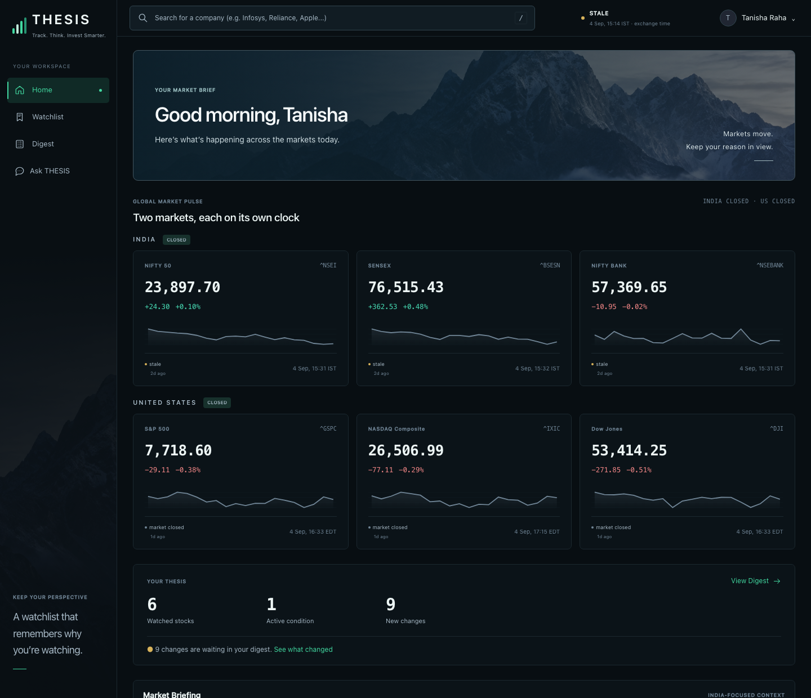
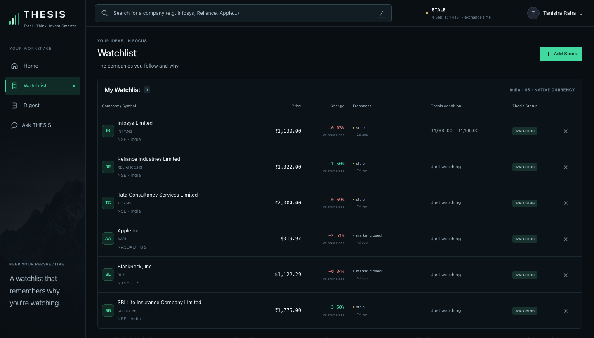
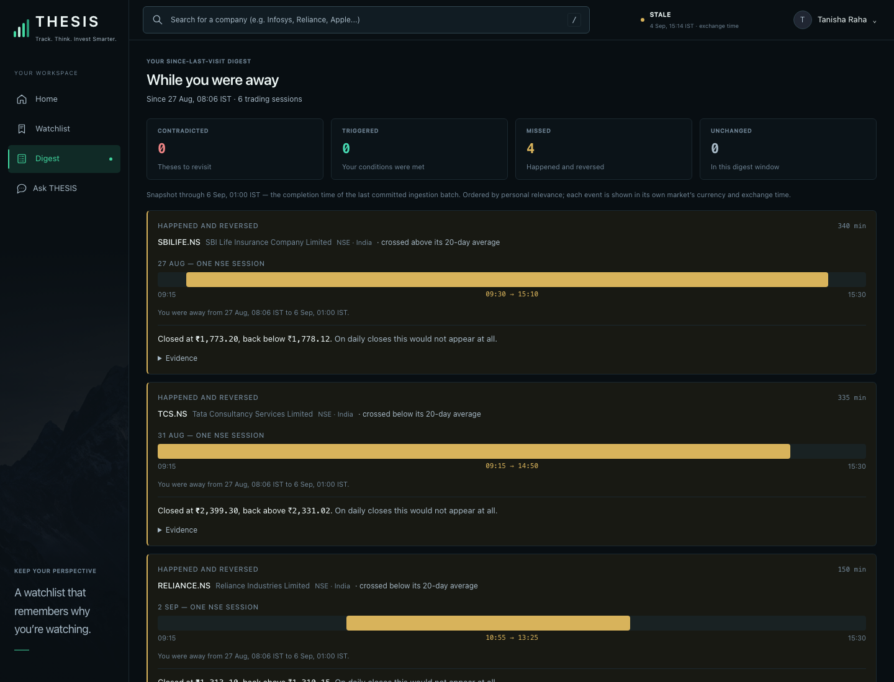
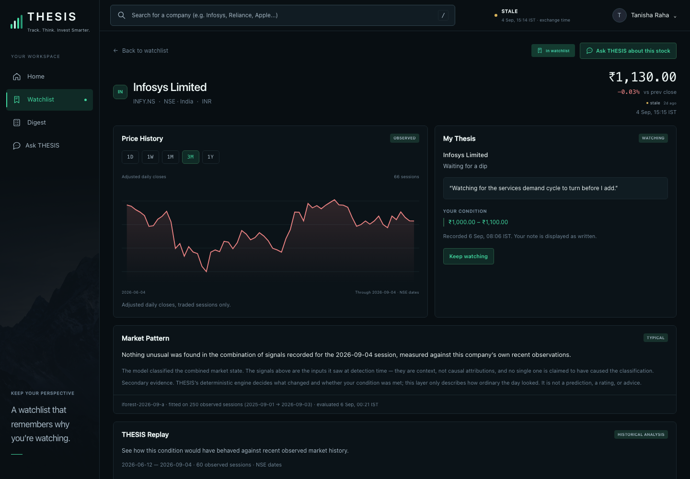
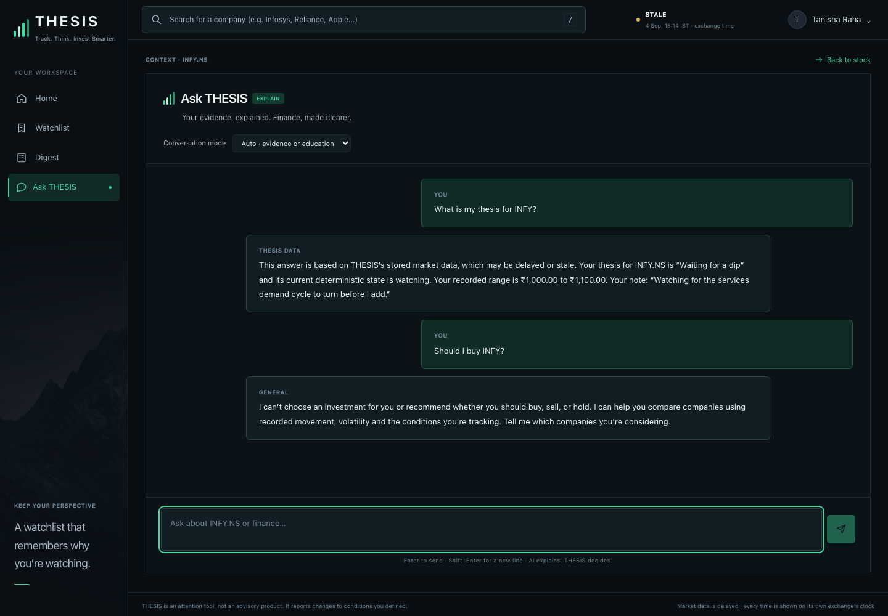
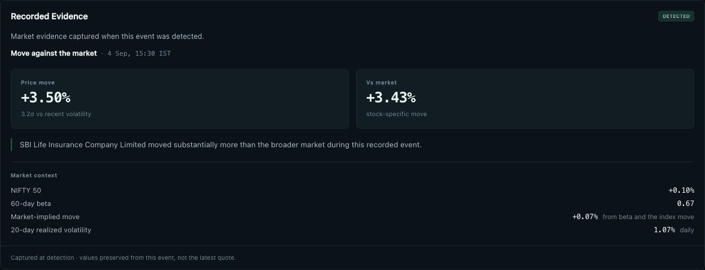
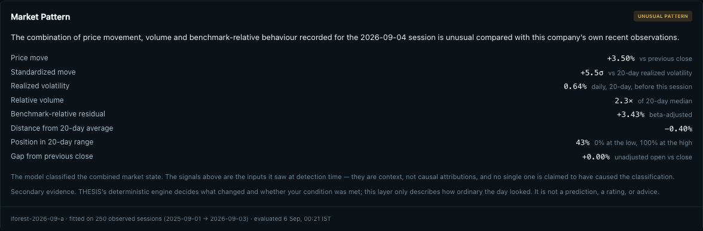
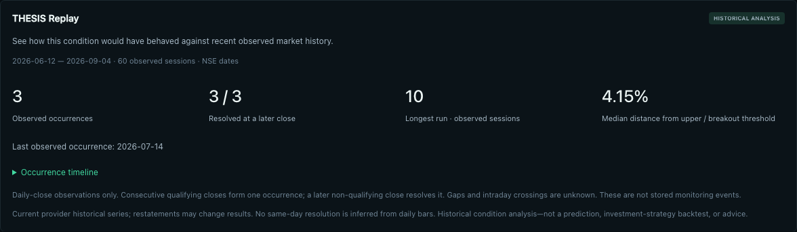
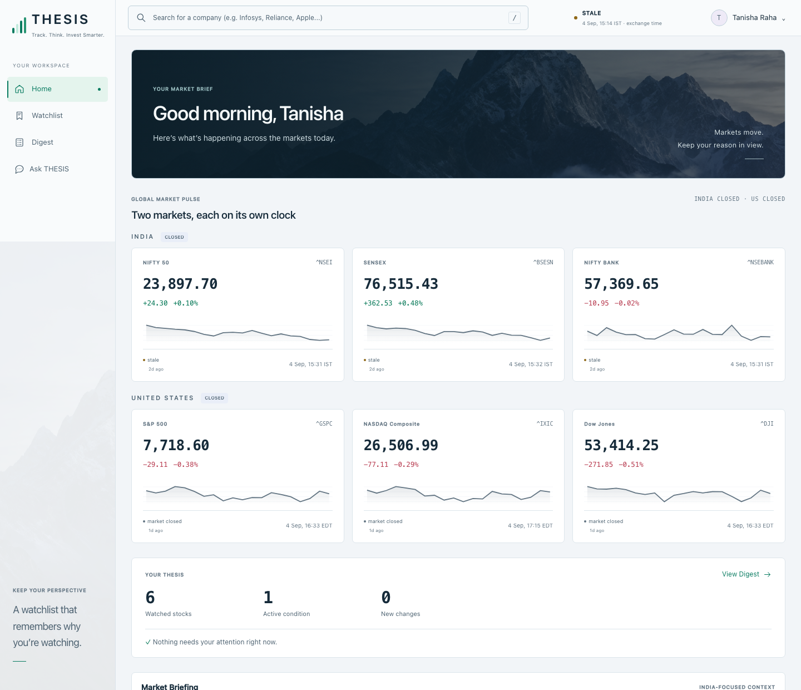
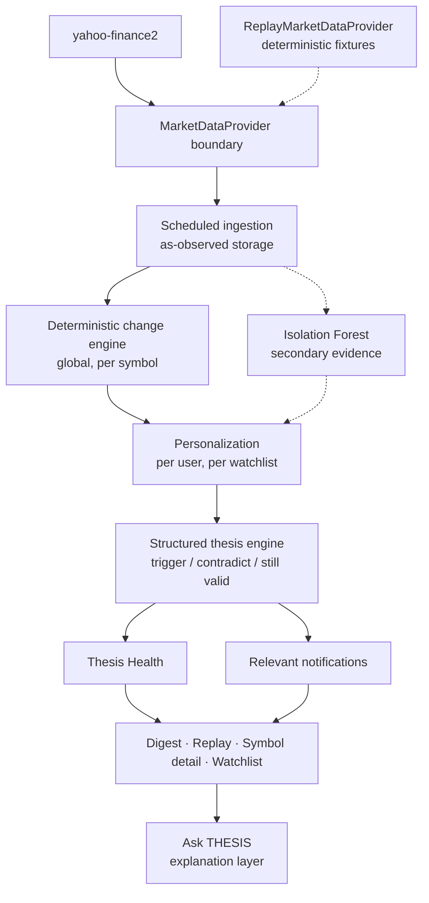

# THESIS

**A watchlist that remembers why you're watching.**

THESIS is a smart market watchlist built around one question:

> Since I last checked, what changed — and does it matter to the reason I was
> watching this stock?

Traditional watchlists remember **what** you follow.
THESIS remembers **why**.

**[Live demo](https://thesis-market-watchlist.vercel.app)** ·
**[Engineering decisions](DECISIONS.md)**

Built for **Code, by Groww 2026** — theme: *Build a Smart Market Watchlist*.

> **THESIS evaluates your stated reasoning. You evaluate the investment.**

---

## The problem

A normal watchlist shows prices, charts, percentage changes and headlines. What it
loses is the thing you actually had in your head when you added the stock: *I want
this if it dips into a range*, *I want this only on a confirmed breakout*, *I am
watching whether this trend survives*.

Three days later the list shows a number. It cannot tell you whether that number
means anything **to you**, and if the move happened and reversed while you were
away, the list shows nothing at all.

THESIS lets you attach a structured condition to each security and then evaluates
later market changes against that stated intent. It is an attention system — not a
portfolio manager, not a screener, and not a recommendation engine.

---

## The product

### Home — your market brief

India and the US report their session state separately, each index carries its own
exchange-local timestamp, and a compact strip bridges the market view to your own
reasons for watching.



### Watchlist — what you follow, and why

One list holds `INFY.NS` in ₹ on Mumbai time next to `AAPL` and `BLK` in $ on New
York time. Nothing is converted or aggregated across currencies, and every row
carries your condition, its deterministic state and its Thesis Health.



### While you were away

Four events that **fired and reversed inside a single trading session** while this
account was away — each proved invisible on daily closes. This is the clearest
demonstration of what THESIS is for.



### Company detail

| | |
|---|---|
|  |  |
| **Price history and your thesis.** Ranges are offered only where observations exist — 1D/1W from the observed intraday path, 1M/3M/1Y from daily closes. | **Ask THESIS.** Answers from your stored evidence, and declines to recommend a trade. |
|  |  |
| **Recorded Evidence.** The figures captured when the event fired, never recomputed from the latest quote. | **Market Pattern.** The anomaly layer's one claim, kept separate from the evidence it saw. |
|  |  |
| **Thesis Replay.** How *your* condition behaved against observed history — occurrences, not returns. | **Appearance.** The same information hierarchy in Light, Dark and Aurora. |

*Every screenshot is the running application against real stored market data,
captured from a production build by `npm run screenshots`.*

---

## Key features

### Smart watchlist
Securities tracked with their last committed quote, the exchange timestamp it was
reported at, a freshness label, and the structured reason you recorded. Each row
renders in its own currency and on its own exchange clock.

### Structured theses
A condition, chosen when you add a company:

| Type | Meaning |
|---|---|
| `price_range` | Waiting for a dip into a range you set |
| `breakout` | A close above a level, confirmed by volume |
| `momentum_up` / `momentum_down` | A trend you expect to continue |
| `volatility_watch` | Watching for unusual moves |
| `volume_expansion` | Watching for sustained volume |
| `none` | Just watching |

Your free-text note is **display-only**. It is shown back to you exactly as written
and never parsed, scored or fed to any engine.

### While you were away
A per-user digest of what happened since your last visit: contradictions, triggers,
missed events and anomalies, ordered by personal relevance. Its cutoff is the
completion time of the last **fully committed** ingestion batch — never `now()` —
and each security carries its own monotonic read watermark, so opening one company
never marks the rest as seen.

### Meaningful change detection
Deterministic and explainable. An event is recorded only from stored evidence:
standardized price movement against the security's own 20-day realized volatility,
relative volume against its 20-day median, benchmark-relative residual, moving-average
and 20-day/52-week range crossings, and the overnight gap. Firing and clearing use
separate thresholds (2.0σ / 1.5σ, 2× / 1.2× volume) so a value hovering on the line
cannot flicker, with a 24-hour cooldown and 1.5× escalation.

### Thesis Health
A state for every watched security **with a structured condition**:

| State | Derived from |
|---|---|
| **STRONG** | Nothing adverse outstanding — including a brand-new thesis |
| **NEEDS ATTENTION** | The condition you were waiting for was met and you have not reviewed it |
| **MATERIALLY WEAKENED** | A contradiction was recorded and acknowledged, and nothing has met the condition since |
| **INVALIDATED** | A standing contradiction: the engine's own rule — two of three independent conditions holding together across three consecutive sessions |

It is *derived, not scored*: a pure function of the thesis state machine and the
verdicts the engine already committed. Missing history, a stale quote, a degraded
feed and an anomaly classification are not inputs and cannot move it.

**Thesis Health evaluates your structured thesis, not the stock. It never means
Buy, Hold or Sell.**

### Thesis Replay
Walks your saved condition across recent observed daily closes and reports what
occurred: occurrences, how many resolved at a later close, the longest run, the
median distance from your threshold. **This is not a return backtest and does not
predict future prices.**

### Missed events and reversals
An event that opened and closed while you were away leaves no trace in current
state — only in the sequence of observations. THESIS preserves it, and says whether
a daily close could have shown it at all.

### Market Pattern — secondary ML evidence
An Isolation Forest (100 trees, 256-row subsample, seeded, `iforest-2026-09-a`)
implemented in TypeScript in this repository. It is fit per security on up to 250
observed sessions and requires at least 60 usable rows; below that it produces no
classification rather than a fabricated one. Features are the eight stored signals:
daily return, standardized return, realized volatility, log relative volume,
benchmark residual, distance from the 20-day average, position in the 20-day range,
and the gap return.

- The deterministic thesis logic does not depend on it in any way.
- An anomaly classification **cannot** independently invalidate a thesis.
- No score is shown — the raw output is stored for reproducibility, not rendered.
- It says one thing: the combination of recorded signals for this session was
  unusual for this security. It never explains why, because Isolation Forest cannot.

### Relevant notifications
An in-app notification centre. THESIS does not notify because a price moved; it
notifies when committed evidence matters to a condition you saved. Each notification
carries the company, the state, one sentence of why, the time and a link to the
evidence.

- Types: condition triggered, thesis materially weakened, thesis invalidated,
  trigger reversed, missed event.
- Read/unread with a mark-all-read action.
- Per-user preferences for each signal, plus a master in-app toggle.
- Every row is tied to the committed thesis verdict or change event it came from,
  and a unique index over that identity makes generation idempotent — the same
  underlying event can never notify twice.
- Delivery is channel-aware in the schema; **in-app is the only channel implemented.**

### Ask THESIS
A finance assistant that also holds your records. Routing is decided by **ownership,
not by company names** — *"Tell me about Reliance"* is a finance question, *"Explain
my Reliance thesis"* is not.

| Intent | Behaviour |
|---|---|
| **GENERAL** | Markets, investing, accounting and companies in general terms. Where THESIS has recorded something about a company that came up, a clearly separated *"From your THESIS data"* block is appended — it enriches, never replaces. |
| **GROUNDED_THESIS** | Your watchlist, saved condition and note, deterministic verdict, detected events with detection-time evidence, anomaly classification, replay, and what the engine's contradiction rule requires. Composed on the server from committed rows. |
| **ADVISORY** | No buy, sell, hold, price target or forecast. One sentence of refusal, then the evaluation framework and any recorded evidence. |
| **FOLLOW_UP** | A message with no content of its own — *"why does that matter?"* — resolves to whatever the conversation was doing, carrying its companies and concepts. |

`OPENAI_API_KEY` is **optional**. When set, general questions go to the OpenAI
Responses API. Without it, a built-in 60-concept table answers concepts, frameworks,
company evidence and comparisons, and anything outside them says so plainly rather
than guessing. Grounded answers are composed on the server and are never sent to any
external service; turns carrying them are stripped from the history the model sees.

### Global market pulse
Six indices across two markets — NIFTY 50, SENSEX, NIFTY BANK, S&P 500, NASDAQ
Composite, Dow Jones — each with its own session state and exchange-local freshness.
No single global "market closed" claim is ever made.

### Global security discovery
Search resolves companies on **NSE, BSE, NASDAQ and NYSE** (an explicit allowlist of
provider exchange codes). Results open the company's detail page — search is
discovery, not an add shortcut — and a company you do not watch shows real market
data with no fabricated thesis state.

### Appearance
Light, Dark and Aurora. One preference, resolved before first paint; the same layout
and information hierarchy in all three.

---

## Architecture



**DETECT GLOBALLY → PERSONALIZE PER USER.** Detection runs once per unique symbol
and knows nothing about users; personalization is a separate stage that filters and
orders facts already established. Cost is O(unique symbols), not O(users × symbols).

The dotted paths are optional: the replay provider substitutes for the live one in
tests, and the ML layer contributes secondary evidence that the deterministic engine
never consults.

---

## Engineering decisions

**As-observed storage.** Yahoo returns no raw series — `close` is already
split-adjusted and is restated retroactively. So each bar stores both what the
provider said the first time we saw it (written once, never updated) and its current
opinion. The ratio between them *is* the split factor, so corporate-action detection
falls out of the storage design rather than needing a second feed.

**Provider abstraction.** Every market call goes through one interface, so a
deterministic replay provider substitutes for the network in tests. Detection,
thesis evaluation and the ML layer are all testable without a live market.

**Completed-batch semantics.** The digest cutoff is the completion timestamp of the
last fully committed ingestion batch. Using `now()` would permanently skip any event
whose detection precedes the cutoff but whose commit lands after the query.

**Detection-time evidence.** Every event stores the figures that were true when it
fired. Nothing is recomputed from the latest quote, because evidence that changes
after the claim is not evidence.

**Exchange-local time.** Every instant is stored in UTC; trading dates are the
exchange's own calendar dates. A NASDAQ session is never keyed by an Indian date.

**Idempotence everywhere.** Re-running ingestion, detection, anomaly evaluation or
notification generation over the same evidence writes nothing new — enforced by
unique indexes in the database, not by application-level checks.

**LIVE / DEMO isolation.** The demo dataset and live data never mix, in detection,
anomaly evaluation, notifications or display.

**Optional ML.** The Isolation Forest is additive. Dropping its table would leave
the deterministic product intact.

Full reasoning, including what was tried and rejected, is in **[DECISIONS.md](DECISIONS.md)**.

---

## Resilience and edge cases

| Case | Behaviour |
|---|---|
| Stale quote | Last-known-good value shown with its exchange timestamp and a freshness label; never blanked, never invented |
| Provider omission | Batched quotes silently drop unresolvable symbols; consecutive misses are counted so a blip stays invisible while a real delisting surfaces |
| Provider failure | Bounded and caught; the page renders stored state and says what is unavailable |
| Insufficient history | Statistics, replay and anomaly classification are withheld rather than approximated |
| Duplicate ingestion | Unique indexes make re-ingestion a no-op |
| Zero-volume / phantom bars | Excluded from history, statistics and replay |
| Corporate actions | Detected from the first-observed vs current-provider ratio; a validated action pauses replay and rescales the affected condition, showing before and after |
| Duplicate notifications | Impossible: identity is (user, type, source row) |
| Events predating a watch | Never notified — you are not told about something that happened before you were watching |
| LIVE / DEMO | Separate worlds in storage and every read |
| User isolation | Every predicate starts at watchlist membership |
| Anomaly unavailable | Says so; the deterministic engine is unaffected |

---

## Tech stack

| | |
|---|---|
| **Framework** | Next.js 16 (App Router, React 19 server components) |
| **Language** | TypeScript |
| **Database** | PostgreSQL — Neon in production |
| **ORM / migrations** | Drizzle ORM + drizzle-kit (11 migrations) |
| **Styling** | Tailwind CSS v4 with design tokens |
| **Market data** | `yahoo-finance2`, behind a provider boundary |
| **Machine learning** | Isolation Forest, implemented in TypeScript in this repository — no Python service, no external inference |
| **Optional AI** | OpenAI Responses API for general finance chat |
| **XML parsing** | `fast-xml-parser` for the market-news feed |
| **Testing** | Custom assertion runner + Playwright |
| **Hosting** | Vercel (functions co-located with the database region) |

---

## Setup

```bash
git clone https://github.com/tanisha-raha/thesis-market-watchlist.git
cd thesis-market-watchlist
npm install
cp .env.example .env.local
```

Fill in `.env.local`:

| Variable | Required | Purpose |
|---|---|---|
| `DATABASE_URL` | **yes** | Postgres connection string (Neon pooled URL, or any Postgres) |
| `SESSION_SECRET` | no | Legacy template field; auth uses random opaque tokens and stores only their hashes |
| `CRON_SECRET` | for ingestion | Shared secret for `/api/ingest`. Without it the route refuses every request rather than failing open |
| `OPENAI_API_KEY` | **optional** | Enables open-ended general finance chat in Ask THESIS |
| `OPENAI_MODEL` | optional | Defaults to `gpt-4.1-mini` |

Then:

```bash
npm run db:migrate
npm run dev
```

Open **http://localhost:3000**.

### Without `OPENAI_API_KEY`

Everything except open-ended general chat works unchanged: the watchlist, structured
theses, detection, the digest, missed events, Thesis Health, notifications, Replay,
the Isolation Forest layer, search, and every grounded Ask THESIS answer about your
own data. General finance questions fall back to a built-in 60-concept table.

> **The core product is deterministic and fully functional without AI. The AI layer
> is optional presentation garnish, not a system dependency.**

---

## Testing

| Command | What it does |
|---|---|
| `npm run typecheck` | TypeScript, no emit |
| `npm test` | Assertion suite — engine, thesis, digest, ML, health, notifications, chat routing |
| `npm run smoke` | Live-provider checks against the real market feed |
| `npm run build` | Production build |
| `npm run browser-check` | Playwright end-to-end against a production build |
| `npm run visual-check` | Layout matrix, four viewports × three appearances |
| `npm run navigation-check` | Real click-to-usable navigation timings |
| `npm run db:check` | Schema drift check |

**Latest verified run:** typecheck clean · **287 assertions passing** · **48 smoke
checks** · clean production build · **144 browser checks** · **133 layout captures**
across four viewports in all three appearances · navigation assertions passing.

---

## Non-advisory boundary

THESIS is an attention and reasoning tool, not an investment adviser.

It does not:

- issue Buy / Hold / Sell ratings
- predict future prices or returns
- rank securities as investments
- treat anomaly detection as investment advice

Market data is delayed and provided as-is. Every price is shown with the time the
exchange reported it.

---

*Built for Code, by Groww 2026 — theme: Build a Smart Market Watchlist.*
